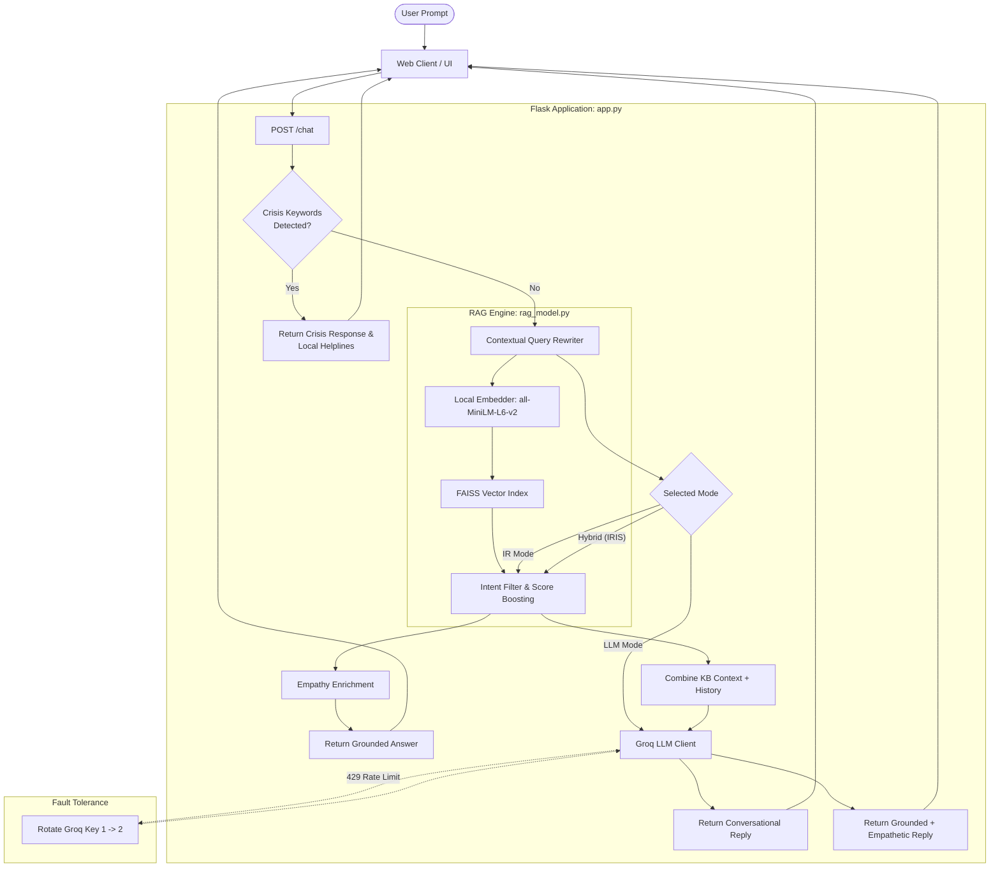

# 🌿 MindSpace (IRIS) — Mental Health Support AI

[](https://www.python.org/)
[](https://flask.palletsprojects.com/)
[](https://groq.com/)
[](https://sbert.net/)
[](https://github.com/facebookresearch/faiss)
[](https://render.com/)
[](LICENSE)

> **MindSpace** is an empathetic, retrieval-augmented conversational AI companion providing grounded mental health guidance, psychoeducation, and automated multi-country crisis intervention.

🌐 **Live Demo:** [https://mindspace-chatbot-4f82.onrender.com/](https://mindspace-chatbot-4f82.onrender.com/)

---

## 📑 Table of Contents
- [Overview](#-overview)
- [Key Features](#-key-features)
- [System Architecture](#-system-architecture)
- [Directory Structure](#-directory-structure)
- [Prerequisites](#-prerequisites)
- [Local Setup & Installation](#-local-setup--installation)
- [Deployment on Render](#-deployment-on-render)
  - [Option A: Deploy via Render Blueprint (Recommended)](#option-a-deploy-via-render-blueprint-recommended)
  - [Option B: Manual Web Service Setup](#option-b-manual-web-service-setup)
- [API Reference](#-api-reference)
- [Configuration & Environment Variables](#-configuration--environment-variables)
- [Safety & Medical Disclaimer](#-safety--medical-disclaimer)

---

## 🧠 Overview

MindSpace is designed to provide immediate, warm, and structured emotional support while ensuring that sensitive inquiries receive validated, safe guidance. Rather than relying solely on generative language models (which can hallucinate or fail during critical mental health conversations), MindSpace introduces **IRIS**—a hybrid RAG (Retrieval-Augmented Generation) pipeline combining dense semantic vector search with high-speed LLM enrichment.

---

## ✨ Key Features

### 1. Tri-Mode Interaction Pipeline
Users can toggle between three tailored operating modes:
- 🌿 **IRIS (Hybrid RAG + LLM - Default):** Combines dense vector retrieval from a curated clinical knowledge base with Groq-accelerated LLM synthesis to generate grounded, empathetic, and human-like answers.
- 🗂️ **IR Model (Local Vector Search):** Pure knowledge base retrieval powered by `FAISS` and `all-MiniLM-L6-v2`. Operates completely deterministically without external LLM dependencies.
- ✨ **LLM Mode (Conversational Persona):** Free-flowing conversational support powered by Groq LLMs, guided by compassionate system prompts and safety constraints.

### 2. Multi-Tier Crisis Detection & Helplines
- **Pre-Search Interception:** Instant detection of high-risk keywords and expressions (suicidal ideation, self-harm, severe distress).
- **Dynamic Country Routing:** Automatic crisis helpline routing for **14+ countries** (India, USA, UK, Canada, Australia, Germany, France, Brazil, Japan, South Africa, Pakistan, Bangladesh, Nepal, Sri Lanka).
- **Emergency UI Banner:** Displays direct 24/7 helpline links and emergency calling/WhatsApp shortcuts.

### 3. Dual-Key API Rotation & Resilience
- Built-in automatic API key rotation across multiple Groq API keys (`GROQ_API_KEY_1`, `GROQ_API_KEY_2`).
- Seamless failover on HTTP `429` (Rate-Limit) errors without interrupting user sessions.

### 4. Semantic Search & Query Expansion
- **Sentence-Transformers:** Generates 384-dimensional dense vectors using `all-MiniLM-L6-v2`.
- **Cosine Similarity via FAISS:** Fast Inner Product search with L2-normalized embeddings.
- **Smart Scoring Engine:** Applies contextual boosts based on detected intent, emotional category, and alternate phrasing matches.
- **Query Rewriter:** Uses chat history to transform conversational follow-ups (e.g., *"why does it happen?"*) into standalone search queries.

### 5. Modern Aesthetic Interface
- Calming botanical color palette with smooth animations.
- **Light & Dark Mode** toggle with persisted user preference.
- Real-time confidence score indicators and category badges.
- Responsive mobile & desktop layout.

---

## 🏛️ System Architecture



---

## 📂 Directory Structure

```text
sem8sj/
├── data/
│   ├── artifacts/                      # Precomputed vector indices & metadata
│   │   ├── embeddings.npy              # Cached document embeddings
│   │   ├── faiss_index.bin             # Binary FAISS search index
│   │   └── metadata.pkl                # Serialized knowledge base records
│   └── mental_health_knowledge_v2.json # Curated Q&A mental health knowledge base
├── templates/
│   └── index.html                      # Single-page application (HTML5 + CSS3 + Vanilla JS)
├── .env.example                        # Template for environment configuration
├── .gitignore                          # Git tracking exclusion rules
├── Procfile                            # Gunicorn process definition for Render / Heroku
├── README.md                           # Project documentation
├── app.py                              # Flask application, routing, and Groq LLM integration
├── rag_model.py                        # FAISS vector search, embeddings, & query expansion
├── render.yaml                         # Infrastructure-as-code blueprint for Render
├── requirements.txt                    # Python dependencies
└── runtime.txt                         # Specified Python runtime version
```

---

## 📦 Prerequisites

Ensure you have the following installed on your local machine:
- **Python 3.10+** (Python 3.10 or 3.11 recommended)
- **Git**
- At least one **Groq Cloud API Key** ([Get your free key here](https://console.groq.com/keys))

---

## 🚀 Local Setup & Installation

### 1. Clone or Open the Repository
```bash
git clone <your-repo-url>
cd sem8sj
```

### 2. Create and Activate a Virtual Environment

**On Windows (PowerShell):**
```powershell
python -m venv .venv
.\.venv\Scripts\Activate.ps1
```

**On macOS / Linux:**
```bash
python3 -m venv .venv
source .venv/bin/activate
```

### 3. Install Dependencies
```bash
pip install --upgrade pip
pip install -r requirements.txt
```

### 4. Configure Environment Variables
Create a `.env` file in the root directory (or copy from `.env.example`):
```bash
cp .env.example .env
```

Edit `.env` and fill in your keys:
```env
FLASK=your_secure_random_flask_secret_key
GROQ_API_KEY_1=gsk_your_primary_groq_api_key
GROQ_API_KEY_2=gsk_your_secondary_groq_api_key_optional
```

> **Note:** `GROQ_API_KEY_2` is optional. If provided, the system will automatically rotate between keys on quota limits.

### 5. Run the Application
```bash
python app.py
```
Open your browser and navigate to:
```text
http://127.0.0.1:5000
```

---

## ☁️ Deployment on Render

MindSpace is pre-configured for seamless deployment to **[Render](https://render.com/)**.

### Option A: Deploy via Render Blueprint (Recommended)

1. Push your repository to GitHub or GitLab.
2. Sign in to your [Render Dashboard](https://dashboard.render.com/).
3. Click **New +** and select **Blueprint**.
4. Connect your GitHub repository.
5. Render will automatically read [`render.yaml`](file:///c:/Users/dell/Desktop/sem8sj/render.yaml) and configure:
   - **Service Name:** `mindspace-chatbot`
   - **Environment:** `Python 3.10.13`
   - **Build Command:** `pip install --upgrade pip && pip install -r requirements.txt`
   - **Start Command:** `gunicorn --bind 0.0.0.0:$PORT --workers 1 --threads 2 --timeout 120 app:app`
6. When prompted in the Render Dashboard, fill in the values for:
   - `GROQ_API_KEY_1`: Your primary Groq API key.
   - `GROQ_API_KEY_2`: Your backup Groq API key (or re-enter key 1).
7. Click **Apply**. Render will build and deploy your app with a public URL (e.g., `https://mindspace-chatbot.onrender.com`).

---

### Option B: Manual Web Service Setup

If deploying without the blueprint:

1. In the Render Dashboard, click **New +** > **Web Service**.
2. Connect your repository.
3. Configure the following settings:
   - **Name:** `mindspace-chatbot`
   - **Language / Runtime:** `Python`
   - **Branch:** `main` (or `master`)
   - **Build Command:**
     ```bash
     pip install --upgrade pip && pip install -r requirements.txt
     ```
   - **Start Command:**
     ```bash
     gunicorn --bind 0.0.0.0:$PORT --workers 1 --threads 2 --timeout 120 app:app
     ```
   - **Instance Type:** `Free`
4. Under **Environment Variables**, add:
   | Key | Value / Note |
   | :--- | :--- |
   | `PYTHON_VERSION` | `3.10.13` |
   | `FLASK` | Any random secure string (e.g. `d9f8234a7c1b4e098`) |
   | `GROQ_API_KEY_1` | Your Groq API Key |
   | `GROQ_API_KEY_2` | Your Secondary Groq API Key (Optional) |
5. Click **Create Web Service**.

### ⚠️ Render Free Tier Tips & Best Practices
- **Worker Configuration:** Free tier instances have 512 MB RAM. Keep Gunicorn at `--workers 1 --threads 2`. Running multiple workers will cause Out-Of-Memory (`exit code 137`) errors due to multiple PyTorch instances.
- **Worker Timeout:** Set `--timeout 120`. Loading `SentenceTransformer('all-MiniLM-L6-v2')` on a cold container boot can take 25–40 seconds.
- **Cold Boot Spin-Down:** Free instances spin down after 15 minutes of inactivity. The first incoming request will take ~30–50 seconds to wake the service. Subsequent requests respond in milliseconds.

---

## 📡 API Reference

### `POST /chat`
Sends a message to MindSpace and receives an empathetic response.

#### Request Body
```json
{
  "input": "I have been feeling very anxious before my exams.",
  "mode": "hybrid",
  "country": "India",
  "history": [
    {"role": "user", "text": "Hello"},
    {"role": "bot", "text": "Hi there. How are you feeling today?"}
  ]
}
```

#### Parameters
| Parameter | Type | Required | Default | Description |
| :--- | :--- | :--- | :--- | :--- |
| `input` | `string` | **Yes** | — | The user's query or statement. |
| `mode` | `string` | No | `"hybrid"` | Mode selection: `"hybrid"`, `"ir"`, or `"llm"`. |
| `country` | `string` | No | `"India"` | Country for helpline matching. |
| `history` | `array` | No | `[]` | Previous message objects `[{role, text}]`. |

#### Sample Response (Hybrid / IRIS)
```json
{
  "response": "Exam anxiety is completely normal and something many people experience. Try taking slow, deep breaths to ground your nervous system. Breaking your revision into small 20-minute chunks can also make the material feel much more manageable.",
  "confidence": 0.885,
  "category": "anxiety",
  "mode": "hybrid",
  "rag_used": true,
  "is_crisis": false
}
```

#### Sample Response (Crisis Interception)
```json
{
  "response": "I'm really sorry you're feeling this way. You're not alone.\n\nPlease consider reaching out immediately to Tele-MANAS: 14416 or someone you trust.\n\nIf you're in immediate danger, please contact local emergency services.",
  "is_crisis": true
}
```

---

## ⚙️ Configuration & Environment Variables

| Variable | Required | Description | Example |
| :--- | :---: | :--- | :--- |
| `FLASK` | Recommended | Flask application session secret key | `super-secret-key-12345` |
| `GROQ_API_KEY_1` | **Yes** | Primary Groq API key for LLM inference | `gsk_...` |
| `GROQ_API_KEY_2` | Optional | Secondary Groq API key for automatic failover | `gsk_...` |
| `PYTHON_VERSION` | Optional | Python version for deployment platforms | `3.10.13` |

---

## 🩺 Safety & Medical Disclaimer

> **IMPORTANT:** MindSpace is an educational and supportive conversational AI platform. **It is NOT a medical device, licensed medical professional, or clinical diagnostic tool.** It cannot diagnose, treat, prevent, or cure any mental health or medical disorder. 
> 
> If you or someone you know is in crisis, having thoughts of self-harm or suicide, or experiencing a medical emergency, please immediately call your local emergency services (e.g., **911** in the USA, **112** in Europe, **14416 / 112** in India) or reach out to a certified helpline.
